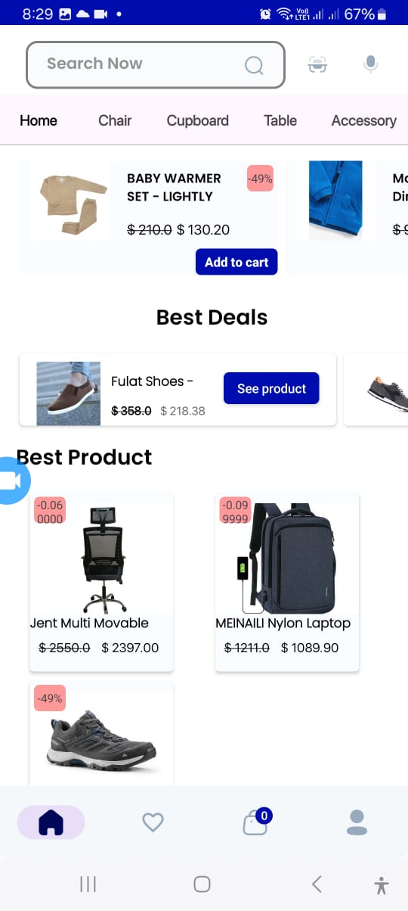
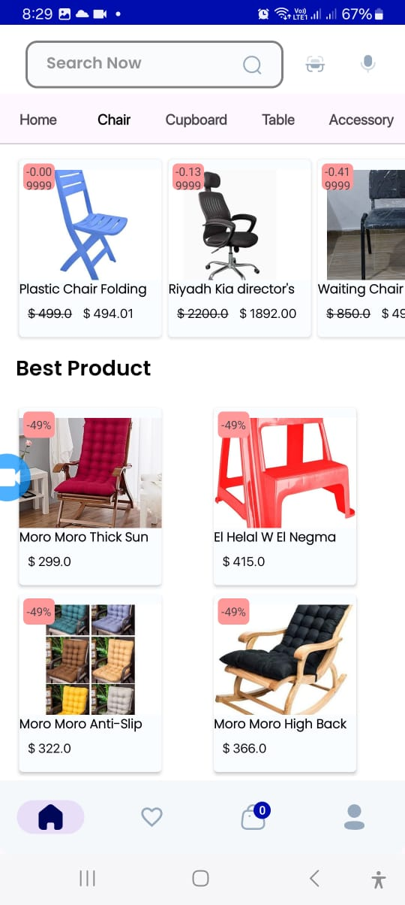
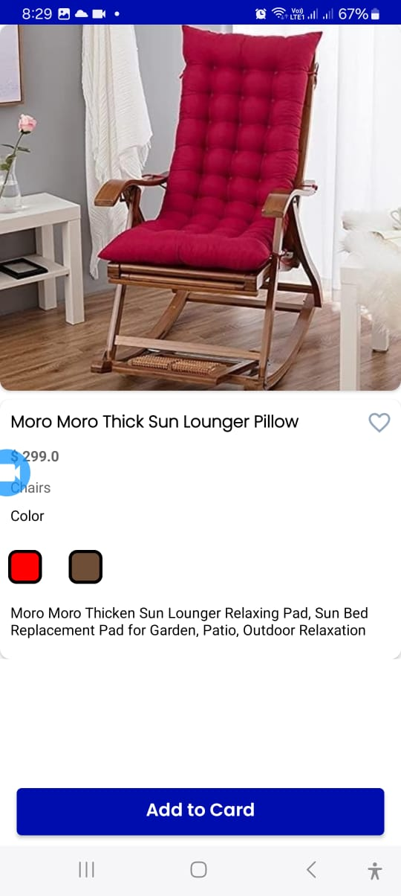

# ShopHub 

ShopHub app targets people who are looking to buy high quality furniture products for their house e.g : cupboards, chairs. And it targets merchants that sell furniture products to enable them to spread their markets and put their products online so everyone can check them out and order them.

# Libraries and technologies used

* Navigation component : one activity contains multiple fragments instead of creating multiple activites.
* Firebase Auth : Manging Accounts/ Loging in and Registrations.
* Firebase Firestore : Database for the system.
* Firebase Storage : To store proucts images and user profile pictures.
* MVVM & LiveData : Saperate logic code from views and save the state in case the screen configuration changes.
* Coroutines : do some code in the background.
* data binding : instead of inflating views manually data binding will take care of that.
* Glide : Catch images and load them in imageView.

# ScreenShoots

    
    

    
    
    

    
    
    
    

    
    

    

